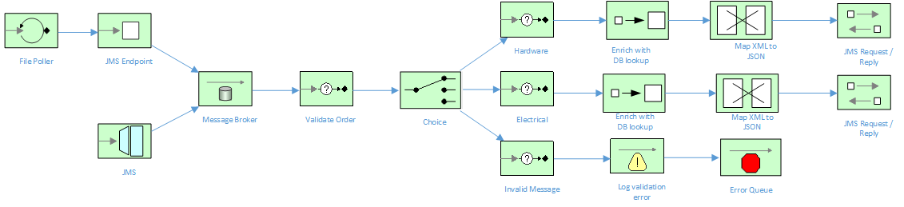
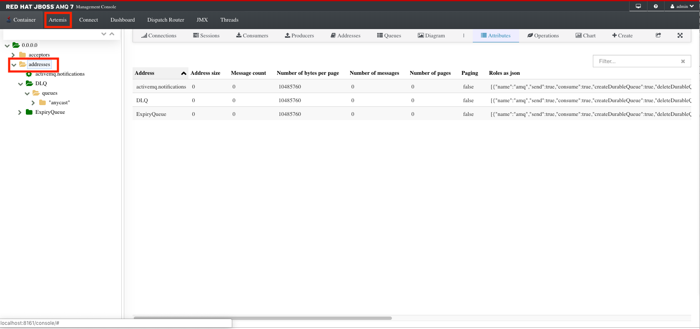
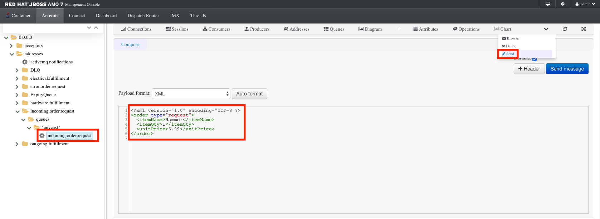
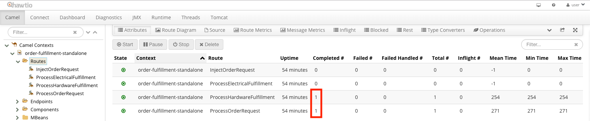

# Order Fulfillment Routes in Fuse 7.1 Standalone

This project is centered around an order fulfillment system for a hardware retailer.  Orders are consumed by Fuse from either a File or JMS-based interface, validated then processed according to their category.  Each order request is then individually transformed into an order fulfillment message, then transferred to the corresponding system for processing.

All of the project is implemented in Fuse Standalone (using JBDS) by a Developer.

The Camel routes used in this example are explained by the following diagram:



## Prerequisite installation steps

### Setup + Run AMQ 7.x

1.  Download AMQ 7.x from [here](https://access.redhat.com/jbossnetwork/restricted/softwareDownload.html?softwareId=58991&product=jboss.amq.broker)
2.  Unzip the `amq-broker-7.2.0-bin.zip` file to a local directory
3.  Via the command-line, `cd` to `/amq-broker-7.2.0/bin` and run `./artemis create broker ../brokers/mybroker` to create your broker.
4.  Enter `admin` as the username and password, and `Y` to allow anonymous access.
5.  Via the command-line, `cd` to `../brokers/mybroker/bin`
6.  Run `./artemis run` to startup the broker locally.
7.  Open a web browser and navigate to `http://localhost:8161/console`, logging in with the `admin/admin` credentials
8.  Navigate to the **Artemis** menu, then click the **addresses** folder to verify you can view the AMQ queues



## Build & Run

### Running locally

1. Via the command-line, you should be able to run this project locally using mvn, and it should work as expected:

	```bash
	mvn spring-boot:run -s configuration/settings.xml
	```

## Running the example in Docker

1. Setup Docker and ensure it is running on your machine.  On MacOS, I ran the following commands:

	```bash
	docker-machine create default
	docker-machine start default
	eval "$(docker-machine env default)"
	```
	
2.  Ensure Docker is accessible from the CLI by typing `docker ps`.  You should get back an empty response indicating no docker images are running.

3.  Run `docker-machine ip` to determine what the IP is for docker.  Update the hostname for `activemq.broker.url` located in `src/main/resources/application.properties` with the docker-machine IP.

4.  To build the project, execute the following:

	```bash
    mvn -s configuration/settings.xml clean package docker:build
    ```
    
5.  To run the project, execute the following:

	```bash
    docker run -p 10001:10001 -t example/order-fulfillment-standalone
    ```

After you've finished running the docker example, be sure to tidy up:

	```bash
     docker ps (to obtain the container ID)
     docker stop <container ID>
     docker rm <container ID>
     ```
     
## Viewing the Fuse Management Console (HawtIO)

Once the application has started up successfully, in any web browser, go to `localhost:10001/hawtio/index.html` and select the Camel tab. You should see your Camel Routes running.  For the docker example, replace this with `http:\\docker-host-ip:10001/hawtio/index.html`.

## Testing the example

You can test the project by manually inserting the messages located in `src/data` into the `incoming.order.request` AMQ queue:

1.  Login to the AMQ 7.x console [here](http://localhost:8161/console/login)
2.  Navigate to the `addresses/incoming.order.request/queues/"anycast"/incoming.order.request` queue.  Click the **Send** button and copy the contents of one of the request.xml messages from `src/data`.  Click **Send**.



3.  Navigate back to the Camel Hawt.IO console and notice that 1 exchange has passed through both the **ProcessOrderRequest** route and the **ProcessHarwareFulfillment** route.



